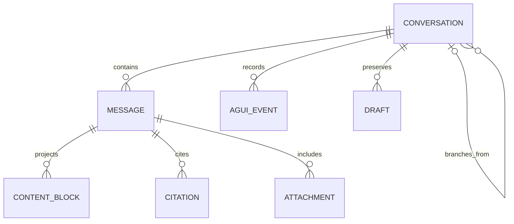
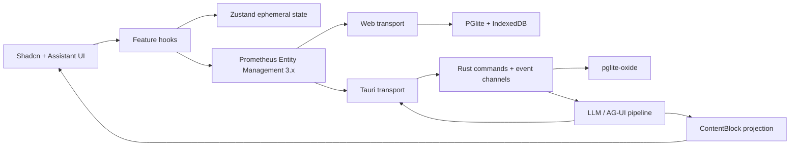

# KnowMe UI/UX Standard

**Status:** Binding product-design standard
**Applies to:** React 19 web/PWA, Tauri desktop, Flutter iOS/Android, generated KnowMe surfaces, and shared UI packages
**Last updated:** 2026-07-17

## 1. Purpose and authority

KnowMe should feel like a private, capable personal-intelligence workspace: calm enough for sustained thinking, transparent enough to trust, and powerful without looking like an infrastructure console.

This standard consolidates the intended experience from the KnowMe functional specification, implementation plan, mood board, user journeys, and current product direction. When an older mockup conflicts with this document, this document wins. In particular, the older mood-board mockups use borders, divider lines, and shadows that are now explicitly superseded by the **Flat 2.0** rules below.

The standard is specific enough to serve as:

- an implementation contract for React and Flutter;
- an acceptance checklist for design and code review;
- the source for scaffold and design-token rules;
- a reference for future OpenDesign artifacts; and
- the basis for visual-regression, accessibility, and cross-platform parity tests.

## 2. Product experience

### 2.1 Product promise

KnowMe is **“AI that understands you.”** It combines private memory, local and user-controlled inference, agent workflows, and cross-device continuity. The interface must make three facts obvious:

1. The system is ready and the user can act immediately.
2. The user can see which model and device are doing the work.
3. The user remains in control of what is stored, synchronized, or sent elsewhere.

### 2.2 Primary users

The mood board identifies four overlapping audiences:

- knowledge workers who need rapid synthesis and continuity;
- privacy-conscious professionals handling sensitive material;
- builders and developers who want inspectable system behavior; and
- cross-device power users who expect conversations and memory to follow them across devices they control.

The UI therefore needs consumer-grade clarity with professional information density. It must not become either a sparse marketing page or a developer-only dashboard.

### 2.3 Experience qualities

Every KnowMe surface should be:

- **Personal:** use human language, remembered context, and a stable sense of place.
- **Local-first:** clearly identify on-device, user-owned remote, and commercial cloud execution.
- **Inspectable:** expose model, tool, citation, memory, and agent activity without flooding the default view.
- **Calm:** use restrained color, few simultaneous calls to action, and predictable motion.
- **Fast:** acknowledge input immediately and stream meaningful output as it arrives.
- **Honest:** show real readiness, progress, provenance, and errors; never fake completion.
- **Continuous:** preserve drafts, history, scroll position, selected model, and conversation state.

## 3. Flat 2.0 is non-negotiable

KnowMe uses a strict **Flat 2.0** visual language.

### 3.1 The rule

**Do not use lines or borders anywhere. Differentiate adjacent screen areas and components only with background-color changes.** Spacing, typography, shape, and content establish hierarchy *within* those areas; they are not substitutes for a required surface-color change.

This applies to application shells, titlebars, sidebars, tab bars, cards, inputs, buttons, menus, dialogs, chat bubbles, code blocks, tables, tool calls, citations, thinking panels, media, and Flutter equivalents.

### 3.2 Required treatment

| Need | Flat 2.0 treatment |
|---|---|
| Separate page from navigation | Use adjacent canvas and navigation background tokens. |
| Separate sections | Use spacing or alternating surface tokens. |
| Group content | Use a filled surface with modest radius and internal spacing. |
| Show hover | Shift to the hover background token. |
| Show selection | Use an accent-tinted background plus stronger text/icon color. |
| Show keyboard focus | Use a high-contrast focus background plus a visible icon, label, or state cue so focus does not depend on color alone. |
| Show input affordance | Use a distinct filled field background, placeholder, and cursor. |
| Show table structure | Use row background changes, alignment, and whitespace—not grid lines. |
| Render a protocol divider | Use vertical space or a surface transition, never an `
` line. |
| Show elevation/modal priority | Dim the underlying canvas and use a distinct modal surface; avoid drop shadows. |

### 3.3 Prohibited treatment

- No `border`, `border-*`, `outline` used as decoration, separators, or input chrome.
- No one-pixel rules between sidebars, headers, rows, messages, or composer regions.
- No card outlines, even transparent outlines that become visible on hover.
- No bevels, skeuomorphic highlights, glassmorphism, gradients, or glossy controls.
- No layout-defining drop shadows. A modal scrim is the preferred depth cue.
- No default Material `Divider`, `OutlineInputBorder`, or outlined button variants.
- No Shadcn defaults may be accepted without removing their border-based styling.
- No status should be communicated by color alone.

### 3.4 Flat does not mean blank

Use a deliberate four-level surface ladder so hierarchy remains immediately legible:

1. **Canvas** — the page background.
2. **Chrome** — titlebar, sidebar, bottom navigation, and persistent utility areas.
3. **Surface** — major panels, composer, menus, and grouped content.
4. **Raised surface** — selected, expanded, modal, or actively streaming regions.

Large undifferentiated empty areas are not acceptable. Empty states must explain the value of the screen and offer a relevant first action.

## 4. KnowMe visual identity

### 4.1 Color system

Color is restrained. Most of the interface is monochrome surface differentiation. Ember is the brand/action color; cyan represents AI annotation and remote/streaming intelligence; green, amber, and red are reserved for status.

| Role | Dark | Light | Use |
|---|---:|---:|---|
| Canvas | `#0B0F14` | `#F7F7F8` | Primary application background |
| Chrome | `#111620` | `#FFFFFF` | Navigation and persistent chrome |
| Surface | `#161D29` | `#FAFBFC` | Panels and grouped regions |
| Raised surface | `#1C2535` | `#FFFFFF` | Selected/expanded/modal regions |
| Hover surface | `#202B40` | `#F2F4F7` | Pointer and keyboard interaction |
| Muted surface | `#253044` | `#EEF0F3` | Inputs, secondary controls, skeletons |
| Primary text | `#E8EDF3` | `#0B0F14` | Titles and body text |
| Secondary text | `#A7B0BC` | `#4B5563` | Supporting information |
| Faint text | `#6B7280` | `#6B7280` | Metadata that still passes contrast |
| Ember | `#FF6A3D` | `#E04E28` | Brand, primary action, active destination |
| Cyan | `#00C2DC` | `#0891B2` | Reasoning, citations, streaming, user-owned remote AI |
| Success | `#22C55E` | `#16A34A` | Ready, connected, completed |
| Warning | `#F59E0B` | `#D97706` | Degraded or attention needed |
| Error | `#EF4444` | `#DC2626` | Failed or destructive state |

Legacy `border` tokens should resolve to transparent or be removed. They must never create visible geometry.

### 4.2 Typography

- **Space Grotesk:** display headings and concise screen titles; tight tracking.
- **Inter:** navigation, controls, labels, and normal application copy.
- **Roboto:** optional long-form reading and assistant prose where it improves readability.
- **JetBrains Mono:** code, model identifiers, timestamps, measurements, event labels, and compact metadata—not entire screens.

Use responsive type roles rather than arbitrary sizes. Body copy should normally be 15–17 logical pixels with a comfortable line height. Do not shrink core UI copy below 12 logical pixels. Respect OS/browser text scaling without clipping or fixed-height text containers.

### 4.3 Logo and iconography

- Use the rounded-bar **K** monogram with the ember node at its joint.
- The wordmark is `Know` plus ember `Me`.
- Keep the logo optically clear against a single flat background.
- Use one coherent line-icon family, normally Lucide on React and its closest semantic Flutter equivalent.
- Icons support labels; they do not replace labels for unfamiliar or consequential actions.

### 4.4 Shape, spacing, and motion

- Use modest, consistent radii. Controls are softly rounded, not excessively pill-shaped.
- Reserve pills for compact status, model/lane identity, and metadata.
- Use a 4-pixel spacing base with an intentional rhythm: 4, 8, 12, 16, 24, 32, and 48.
- Motion should explain state change. Use short opacity/background transitions and restrained expansion.
- Honor `prefers-reduced-motion` and Flutter accessibility settings.
- Never animate merely to make an idle screen feel busy.

## 5. Responsive application shell

### 5.1 Desktop and wide web

- Use a branded custom titlebar in Tauri with platform-correct window controls.
- Use a left navigation rail/sidebar for top-level destinations.
- Keep the main work area centered within sensible reading widths while allowing data views to expand.
- The active destination uses an ember-tinted background and label/icon emphasis, not an outline.
- Persistent system status—active model, local/remote lane, sync, and readiness—must be available without opening settings.

### 5.2 Phone and narrow web

- Replace the rail with a bottom navigation bar based on width, not OS sniffing.
- Keep the primary action/composer above safe areas and the on-screen keyboard.
- Use a two-column capability grid only when labels remain readable; otherwise use one column.
- Never squeeze the desktop sidebar into a narrow rail of unexplained icons.

### 5.3 Tablet

- Prefer an adaptive rail plus flexible content.
- Conversation history may become a collapsible pane; it must not permanently consume the reading area.

## 6. Component and state standard

### 6.1 React 19 component stack

Use these layers deliberately:

- **Shadcn UI** is the default component vocabulary for buttons, inputs, menus, dialogs, sheets, sidebars, tabs, tooltips, scroll areas, command palettes, and accessible primitives.
- **Assistant UI** owns the chat thread primitives, composer behavior, message lifecycle, thread list integration, streaming affordances, actions, attachments, and assistant-specific interaction model.
- **`@prometheus-ags/gen-ui-react`** owns exhaustive rendering of the shared `ContentBlock` protocol.
- **React 19 components** implement KnowMe-specific compositions and rich renderers.
- Raw HTML controls should not be introduced when a suitable Shadcn primitive exists. Semantic HTML remains required underneath those components.

Shadcn and Assistant UI are starting points, not permission to ship their default appearance. Every component must use the KnowMe tokens and Flat 2.0 treatment. Remove visible borders, separator rules, default shadows, and unrelated neutral palettes.

### 6.2 Client state and persistence

TanStack Query is not part of the KnowMe architecture.

- **Prometheus Entity Management 3.x** is the entity/query/mutation/reactivity layer for conversations, messages, blocks, citations, attachments, and related client entities.
- **Zustand** stores ephemeral interaction state: active thread ID, composer draft, selected blocks, open panels, temporary stream assembly, scroll intent, and presentation preferences.
- **PGlite** persists browser/PWA conversation entities in IndexedDB-backed storage, preferably through a shared worker for safe multi-tab ownership.
- **pglite-oxide** persists the same relational conversation model in the Tauri Rust layer. React reaches it through typed Tauri commands/events; it does not open the desktop database directly.
- **SQLite + sqlite-vec** is the mobile relational/vector equivalent behind Rust repository traits because pglite-oxide does not support iOS or Android.
- **SurrealDB** remains the graph-memory/RAG store. Conversation citations may reference memory entities without duplicating the graph as component state.

React visual components follow this chain:

`Component → feature hook → Zustand/Prometheus Entity Management → platform transport → database or Rust command`

Flutter follows:

`Widget → @riverpod provider → repository/service → Rust FFI → platform database`

### 6.3 Required ownership boundaries

These libraries are complementary and must not be treated as interchangeable choices:

| Concern | Required owner |
|---|---|
| General React controls, navigation, overlays, and sidebars | Shadcn UI, restyled with KnowMe tokens |
| Thread, composer, attachments, message actions, streaming lifecycle, and thread list | Assistant UI |
| Normalized durable entities, queries, mutations, and reactive projections | `@prometheus-ags/prometheus-entity-management` 3.x |
| Active selection, panel visibility, draft interaction, scroll intent, and in-progress stream assembly | Zustand |
| Browser/PWA relational persistence | ElectricSQL PGlite in IndexedDB |
| Tauri desktop relational persistence | pglite-oxide owned by Rust and exposed through typed commands/events |
| Mobile relational persistence | SQLite/sqlite-vec behind the same Rust repository contracts |
| Personal memory graph and local RAG retrieval | SurrealDB plus the shared Rust memory/RAG pipeline |
| Cross-surface message and agent output | The shared AG-UI/ContentBlock protocol |

Installing Shadcn UI or Assistant UI without mounting their primitives at the real
interaction boundary does not satisfy this standard. Likewise, keeping conversations in
an in-memory Zustand array, while PGlite is merely present as a dependency, does not
satisfy persistence. Durable records must be written incrementally and restored after a
real page refresh or application relaunch.

## 7. World-class conversation experience

### 7.1 Conversation layout

The chat screen consists of four coordinated regions:

1. **Conversation library** — multiple conversations, search, new conversation, rename, pin, archive, delete, and optional grouping.
2. **Conversation header** — title, model/lane identity, readiness, sync/provenance, and contextual actions.
3. **Thread viewport** — virtualized messages and rich streamed blocks with stable scroll behavior.
4. **Composer** — multiline input, attachments, voice entry where supported, model/lane access, stop/regenerate, and send.

On wide screens the library is a Shadcn sidebar. On narrow screens it is a Shadcn sheet/drawer opened from the header. Assistant UI thread-list and thread primitives should be adapted to these surfaces rather than recreating chat behavior by hand.

### 7.2 Multiple conversations

Users must be able to:

- create a conversation instantly and type before persistence finishes;
- return to any prior conversation with its model, messages, citations, and artifacts intact;
- search titles and message content;
- see useful recency groups such as Today, Previous 7 Days, and Older;
- rename, pin, archive, export, and delete conversations;
- preserve unsent drafts per conversation;
- continue the same synchronized conversation on another owned device;
- branch from a message or regenerate without silently destroying the earlier answer; and
- understand whether a conversation is local-only, synced to owned infrastructure, or includes cloud calls.

The empty state should offer focused starter actions based on KnowMe capabilities, not a blank transcript.

### 7.3 Default local-first behavior

Chat must work out of the box without asking the user for provider credentials.

- Tauri defaults to an available local model and can download the product-default model with explicit progress.
- Browser/PWA defaults to WebLLM when WebGPU is available, with model caching in browser storage.
- If a local model is unavailable, explain what is needed and offer a one-action recovery; never expose a raw bridge exception as assistant content.
- Cloud providers are optional enhancements configured later.
- “On-device,” “My server,” and “Cloud provider” must be visually and verbally distinct.

### 7.4 Streaming behavior

- Echo the user message immediately.
- Create one assistant message and incrementally update its blocks; do not append one message per token.
- Preserve the event ordering emitted by the Rust protocol pipeline.
- Keep auto-scroll attached only while the user remains near the bottom. If the user scrolls upward, show a “jump to latest” action rather than stealing position.
- Provide stop generation, retry, copy, branch, and feedback actions.
- Show a subtle streaming state in the active content region; do not rely on a generic spinner when tokens or structured events are available.
- Persist events incrementally so a crash does not erase a long response.

### 7.5 AG-UI/A2UI event presentation

The protocol event stream is product-visible evidence, not debug noise. Store the append-only event record and project it into an exhaustive `ContentBlock` view.

| Block/event | Required presentation |
|---|---|
| Text | Streaming Markdown with stable typography and copy support |
| Thinking | Collapsed by default; cyan-tinted flat surface; duration/token metadata; user-controlled expansion |
| Code | Language label, copy action, optional filename, syntax highlighting, and safe wrapping/scrolling |
| Citation | Inline citation markers plus expandable source cards with title, source, excerpt, and jump/open action |
| Memory | Explain whether memory was read, proposed, written, updated, or rejected; allow inspection and user control |
| Tool use | Named step with pending/running/completed/failed state and inspectable input |
| Tool result | Structured result paired with its tool call; errors are explicit and recoverable |
| Skill | Skill identity, status, parameters, and useful output summary |
| Artifact | Dedicated preview for code, document, visualization, or generated component; preserve source/download |
| Image | Accessible alt text, constrained preview, open/download action, and provenance |
| Divider | Spacing or surface transition only—never a visible line |
| AG-UI state delta | Update the relevant visible state without dumping raw JSON into the thread |
| Confirmation request | Accessible Shadcn dialog/surface with consequences, choices, and safe default; resume the agent after response |

New protocol variants must cause compile-time exhaustiveness failures until React and Flutter renderers are implemented.

The user may open an **activity/event inspector** for a run. It presents the same ordered
event stream at progressively deeper levels rather than inventing a second debug-only
model:

- the normal thread shows human-readable text, thinking, memory, citation, tool, skill,
  confirmation, state, and artifact blocks;
- an expanded block shows its timing, status, model/lane, provenance, and related event
  span;
- an advanced timeline can filter by event family and reveal sanitized payloads, sequence
  numbers, run IDs, retries, and parent/child relationships; and
- replay uses the persisted append-only events to rebuild the materialized thread without
  contacting the model again.

Memory/RAG citations are first-class relationships. A citation chunk links the answer span
to the retrieved memory or source chunk, shows relevance and provenance, and lets the user
inspect the underlying memory without losing their place in the conversation. Thinking
chunks remain collapsed by default, stream live when expanded, and clearly distinguish
model reasoning summaries from tool activity or factual sources.

### 7.6 Markdown and rich media

Assistant prose supports CommonMark plus carefully selected extensions:

- GitHub-flavored tables, task lists, strikethrough, autolinks, footnotes, and fenced code;
- syntax-highlighted code with copy and accessible language metadata;
- Mermaid diagrams rendered lazily in a contained React component, with source and accessible text fallbacks;
- sanitized SVG preview—never execute arbitrary script, event handlers, or external references from model output;
- images with alt text, dimensions, provenance, and safe loading behavior;
- audio/video players with controls, captions/transcripts when available, poster/fallback states, and no autoplay;
- downloadable artifacts with explicit type and size;
- optional math rendering when a product workflow requires it.

Rich content must not use unsafe raw HTML. Sanitize Markdown extensions and remote media, enforce URL/content policies, and give users a source-view fallback when a renderer fails.

Implement each rich format as a typed React 19 renderer registered with the Assistant UI
thread, not as string replacement inside one monolithic message component. Renderers must
be lazy where their dependency is expensive, preserve stable keys while streaming, expose
an error boundary and source fallback, and avoid blocking ordinary text rendering. Mermaid,
SVG, images, video, audio, and artifacts open in a Shadcn sheet/dialog or an optional
side-by-side artifact workspace while the conversation remains visible.

### 7.7 Chat visual treatment

- Assistant responses should read as authored content within the canvas, not as an endless stack of outlined bubbles.
- User messages may use an ember-tinted filled surface aligned to the trailing edge.
- Thinking, citations, tools, and artifacts use distinct background tokens and labels while remaining borderless.
- Keep readable prose width even when the overall workspace is wide.
- Keep the composer visually anchored with a distinct filled surface; do not draw a box around it.
- Errors use a dedicated error surface with plain-language recovery, never raw `invoke`/JavaScript/Rust errors in the transcript.

### 7.8 Conversation library and workspace behavior

The conversation library is part of the working product, not decorative sidebar chrome.
It must be backed by the same persisted conversation entities as the thread and support:

- a prominent new-conversation action and immediate optimistic selection;
- full-text search across titles and message text;
- pinned, recent, archived, local-only, synchronized, and branched views;
- contextual rename, pin, archive, export, and recoverable-delete actions;
- unread/running/failed state without requiring the user to open each thread;
- per-conversation model, execution lane, draft, attachments, and last-read position; and
- responsive presentation as a persistent desktop sidebar or Shadcn sheet on narrow
  layouts.

Selecting another conversation must cancel only view subscriptions; it must not cancel an
unrelated background run. Running conversations continue to persist events and expose their
status in the library. Returning to one restores its thread, active artifacts, expansion
state, draft, and scroll anchor.

## 8. Data model for durable chat

The web and desktop schemas should be logically equivalent even when their platform adapters differ.

Minimum durable records:

- `conversations`: identity, title, timestamps, lane/model preference, sync/privacy mode, parent/branch metadata, pinned/archived state;
- `messages`: conversation, role, ordering, status, timestamps, generation metadata;
- `content_blocks`: ordered typed payloads and stable IDs;
- `agui_events`: append-only event ID, run ID, sequence, event type, payload, timestamp;
- `citations`: message/block relationship, memory/source identity, excerpt, location, provenance;
- `attachments`: metadata, content address, local/cache location, MIME type, dimensions/duration;
- `drafts`: per-conversation composer content and attachment references.

Persist raw protocol events for replay/audit and maintain materialized entities for fast UI rendering. Event IDs and sequence numbers make retries idempotent. Database migrations are versioned and shared at the repository-contract level.

## 9. Screen-specific intent from the mood board

### Home

The home screen is an instrument panel, not a marketing page. It immediately answers “Is the AI ready?” and “What can I do?” Show model/readiness, useful capacity, recent work, and capability entry points with high information density and low visual noise.

### Chat

Chat is the center of personal intelligence. It streams real output, exposes reasoning and citations on demand, preserves conversations, and makes the execution lane unmistakable.

### Hands

Hands should feel like reliable staff rather than scripts. Lead with current status, last useful output, next run, execution device, and accumulated history. Creation remains a short, comprehensible flow.

### Settings and sync

Settings make ownership concrete. Show which devices and servers are reachable, what role the user has, exactly what data may cross the wire, and conservative opt-in defaults for exposure or large transfers.

### Models

Models form a user-owned library, not a storefront. Clearly mark the active model, local versus remote execution, acceleration backend, size, capability, download/load status, and measured performance.

### Memory

Memory is inspectable personal context. Search results show relevance, source, time, and relationships. Memory writes triggered during chat must be visible and controllable.

## 10. Flutter parity

React and Flutter must express the same semantic design system, not merely similar colors.

- Generate both CSS variables and Flutter `ThemeData`/`ThemeExtension` values from one versioned token source.
- Match semantic surface, text, status, spacing, radius, typography, and motion roles.
- Use `shadcn_flutter` components where they provide the matching accessible interaction; otherwise build token-driven Flutter components with the same semantics.
- Do not use stock `ThemeData.dark()`, `ColorScheme.fromSeed`, outlined fields, `Divider`, or default Material elevation as substitutes for the KnowMe theme.
- Use width-based bottom navigation versus rail behavior consistently with React.
- Render the same ContentBlock union exhaustively and preserve AG-UI confirmation/state behavior through Riverpod and Rust FFI.
- Pixel identity between browser and Skia is not required; semantic token and interaction parity is.

## 11. Accessibility and trust

- Meet WCAG 2.2 AA contrast for text, controls, focus, and status.
- Support keyboard-only navigation, logical focus order, skip navigation, and screen-reader landmarks.
- Every icon-only control requires an accessible name and tooltip where appropriate.
- Streaming updates use polite live regions and must not repeatedly interrupt screen readers.
- Expanded/collapsed reasoning, tool, and citation sections expose state programmatically.
- Respect reduced motion, high contrast, text scaling, and platform safe areas.
- Destructive actions explain scope and require confirmation when recovery is not immediate.
- Privacy/execution labels use text and iconography in addition to color.

## 12. Acceptance criteria

A KnowMe UI change is acceptable only when all applicable statements are true:

### Visual

- No visible borders, divider lines, or layout shadows remain.
- Adjacent regions are distinguishable through approved background tokens.
- Light and dark modes both use the KnowMe palette and pass contrast checks.
- The ember accent remains restrained; cyan and status colors retain their meanings.
- Empty, loading, streaming, degraded, offline, and error states are intentionally designed.

### Components and architecture

- React uses Shadcn UI for general primitives and Assistant UI for chat/thread behavior.
- Flutter uses the corresponding token-driven/shadcn_flutter patterns.
- Prometheus Entity Management 3.x—not TanStack Query—owns entity reactivity and mutations.
- Zustand contains transient UI state, not the durable conversation database.
- Web conversations persist in PGlite; desktop conversations persist through Rust in pglite-oxide.
- Visual components call hooks rather than stores, database clients, or Tauri `invoke()` directly.

### Chat

- A new user can send a prompt using a local model without provider configuration.
- Multiple conversations can be created, searched, resumed, renamed, and archived.
- Streaming survives structured text, thinking, citation, tool, memory, artifact, and media blocks.
- Markdown, Mermaid, sanitized SVG, images, and video have safe renderers and fallbacks.
- Refresh/relaunch restores conversation history and per-thread drafts.
- Raw transport/runtime errors never appear as assistant responses.

### Responsive and cross-platform

- Review at 320, 768, 1024, and 1440 CSS pixels in both themes.
- Desktop uses sidebar/rail navigation; phone uses bottom navigation.
- Flutter goldens cover representative phone/tablet states in light and dark modes.
- React and Flutter token hashes/parity checks pass.
- Keyboard, screen-reader, reduced-motion, and text-scaling checks pass.

## 13. Source material

This standard derives from:

- [KnowMe mood board and user journeys](reference-app/knowme-moodboard-user-journeys.html)
- [KnowMe functional specification and architecture](reference-app/knowme-functional-specification-architecture.html)
- [KnowMe PoC architecture and implementation plan](reference-app/knowme-poc-architecture-and-implementation-plan.md)
- [gen_ui technical specification](gen_ui_spec.html)
- [Embedded Postgres/PGlite hybrid architecture](pglite-oxide-tauri-hybrid.md)
- the KnowMe application screenshots and direct product requirements supplied on 2026-07-17.

The mood board remains the visual and journey reference. Its palette, brand identity, information density, local-first trust model, and screen intent remain authoritative. Its border-, divider-, and shadow-based treatments do not; the Flat 2.0 section of this document supersedes them.
