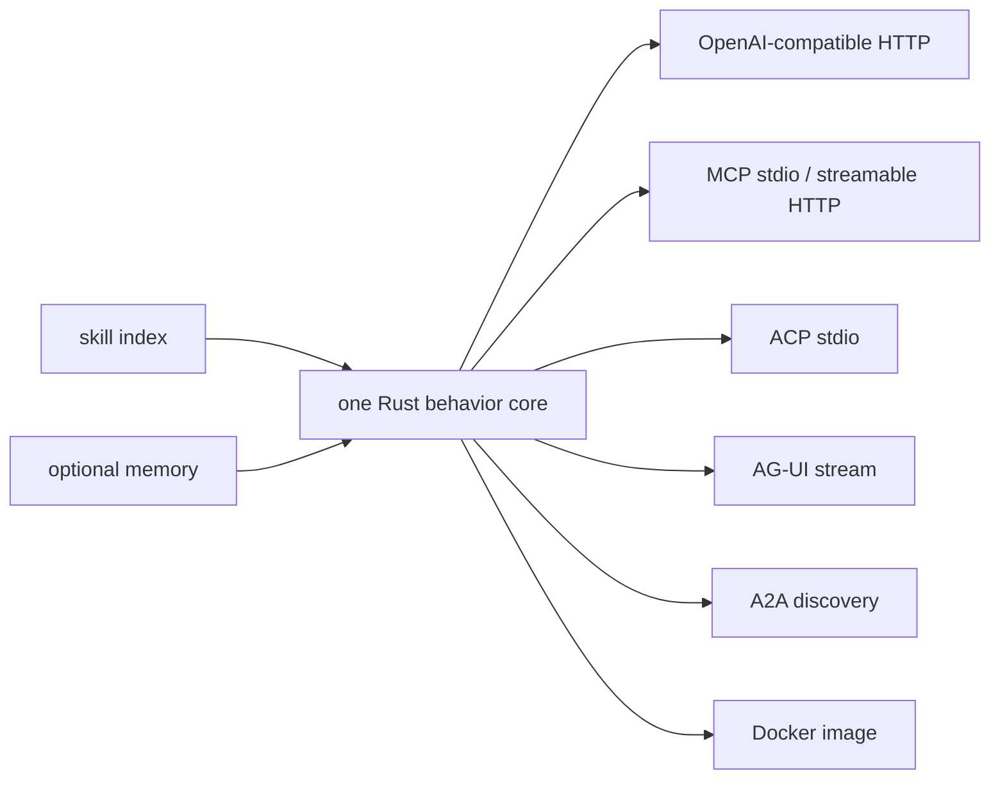

# Agent orchestration

This guide explains when to use a prompt, a skill, or a native agent. It also
records the reviewed lessons from the OpenAI-compatible proxy reference project
without copying stale model catalogs, subscription-auth details, credentials, or
machine-local paths into public docs.

## Evidence classes

| Class | Meaning | Public use |
|---|---|---|
| verified-current | Confirmed from current source files in the reference repository. | Can be used as architecture evidence. |
| verified-historical | Confirmed from commit history or old docs but not proven current. | Use only as timeline context. |
| operator-provided | Supplied by the operator in requirements. | Use as intent, then verify before operational claims. |
| inferred | Reasonable conclusion from source shape. | Label as inference. |
| stale | Contradicted by current registry/source or likely obsolete. | Do not publish as instructions. |
| unsupported | No current source or official evidence. | Exclude from public guidance. |

## OpenAI-compatible proxy case study

The reference project demonstrates what the native-agent creator can produce:
a Rust/Axum service with one behavior core and several delivery adapters.

### Verified-current source inventory

| Capability | Evidence | Class |
|---|---|---|
| Axum service and health route | Library router mounts `/health`. | verified-current |
| OpenAI-compatible chat route | Router mounts `POST /v1/chat/completions`. | verified-current |
| Model list route | Router mounts `GET /v1/models`. | verified-current |
| AG-UI stream route | Router mounts `POST /ag-ui/stream`. | verified-current |
| Optional A2A discovery | Router conditionally mounts `GET /.well-known/agent.json`. | verified-current |
| MCP stdio mode | Main dispatch can run MCP stdio. | verified-current |
| ACP stdio mode | Main dispatch can run ACP stdio. | verified-current |
| Skills loading | Runtime builds a skill index from configured skill directories. | verified-current |
| Optional memory backend | Feature-gated memory store and routes exist. | verified-current |
| Docker packaging | Multi-stage Dockerfile builds a Rust binary and runs as non-root user. | verified-current |
| Integration tests | Tests cover health, models, and live chat behavior when credentials exist. | verified-current |
| OpenCode plugin | Plugin source and package metadata exist. | verified-current |

### Verified-historical and stale material

The reference README contains operational details about model aliases,
subscription-backed auth, and plugin behavior that are useful history but not
safe as current public instructions without official verification. The prompting
guide therefore uses the reference for architecture lessons only:

- one core behavior implementation;
- thin protocol adapters;
- explicit route/consumer proof;
- Docker/launch evidence;
- skill and memory integration patterns;
- OpenCode plugin packaging as a distribution example.

Do not copy its stale model table or undocumented subscription-auth paths into
current generated-product guidance. Current model facts must come from the dated
model registry.

## Architecture map



Protocol adapters translate requests and events. They must not reimplement
agent behavior independently.

## Skill versus native agent

| Use a prompt when | Use a skill when | Use a native agent when |
|---|---|---|
| The task is one-off and simple. | The same process recurs across phases or projects. | The capability needs an independent runtime, protocol server, persistence, or packaging lifecycle. |
| The operator can inspect all work directly. | The work has stable activation conditions and verification gates. | Multiple clients need to call the capability through HTTP, MCP, ACP, AG-UI, A2A, CLI, or background workers. |
| No reusable process gap exists. | A skill can guide an existing harness. | A harness instruction file is insufficient because the system must run outside the harness. |

## Copyable decision prompt

```text
Decide whether this capability should be a prompt, skill, or native agent.

Capability: <description>
Consumers: <humans, harnesses, HTTP clients, MCP clients, ACP clients, UI>
Lifecycle: <one-shot, repeated workflow, long-running service>
Persistence: <none, local, database, event log>
Protocols: <none, CLI, HTTP, MCP, ACP, AG-UI, A2A>
Packaging: <none, skill package, Docker, package registry>
Verification: <public boundary>

Return:
- classification;
- evidence;
- rejected alternatives;
- required skill or agent creator prompt;
- stop conditions.
```

## Native-agent creator prompt

```text
Use the native-agent creator only after the skill-versus-agent decision passes.

Build one Rust core with thin adapters.

Required:
- capability boundary;
- public consumers;
- protocol adapters;
- config and secret boundary;
- health/readiness;
- Docker packaging;
- launch proof;
- consumer smoke tests;
- Karpathy retention.

Do not copy stale model catalogs or unsupported auth paths from examples.
```

## Completion rule

An orchestration task is complete only when the selected path has public-boundary
proof:

- prompt: resulting artifact and verification command;
- skill: scratch-project activation and validation;
- native agent: build, launch, protocol consumer, and package/container proof.
