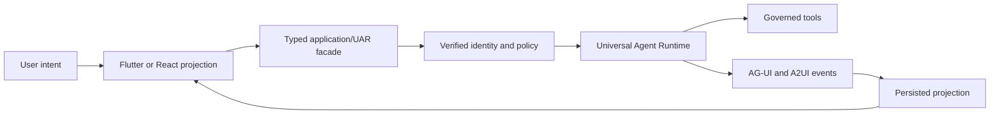

# Why the Builder is designed this way

KnowMe Builder is not a one-shot scaffolder. It is a versioned application
architecture, ownership engine, and instruction package for products that will
continue changing after generation.

## Separate the three authorities

The system has three intentionally independent authorities:

| Authority | Owns | Does not own |
|---|---|---|
| KnowMe Builder | Application architecture, templates, typed adapters, skills, conformance | Live development leases or agent execution |
| Prometheus | Development lifecycle, KBD journal, pause/resume/cancel, lease/fencing, handoff | Application model routing or tool execution |
| Universal Agent Runtime | Agent runs, providers, prompts, tool governance, A2UI/AG-UI lifecycle | Repository planning or generated UI state |

Earlier designs blurred these boundaries. A portable skill could steer a
session, a generated PMPO loop could compete with a runtime, and compatibility
JSON could become a second workflow authority. Separation makes each failure
observable and prevents a convenient client layer from acquiring hidden power.

## Generate ownership, not disposable applications

Real applications diverge immediately: teams add features, migrate data,
change branding, and repair platform behavior. Re-running a scaffold over that
work is destructive.

The Builder therefore records:

- the source template and source digest;
- the last installed digest;
- the current Builder version;
- whether the path is Builder-owned or user-owned; and
- the selected profile and policy overlay.

An upgrade replaces a file only when the consumer content still equals the last
installed content. Otherwise it produces a conflict and a proposed patch.
Stopping is correct behavior: a safe generator must prefer an unresolved review
over silent data loss.

## Canonical source, generated harness payloads

Claude Code, Codex, OpenCode, and Kimi have different discovery and command
surfaces, but the behavioral contract must not change with the harness.

The canonical skill tree is `templates/project-skills`. Generated trees,
marketplace manifests, command wrappers, and activation adapters are derived
from the package manifest. CI compares them byte-for-byte. This prevents one
harness from teaching a different privacy, runtime, or completion rule.

Activation adapters are hints. They can recommend a relevant skill, but they
never own operator pause, mutation leases, or workflow continuation.

## Skills are narrow contracts

Each skill protects one failure-prone boundary:

- a completion gate such as accessibility or physical-device verification;
- an architectural boundary such as PEM or UAR governance;
- a protocol contract such as AG-UI or A2UI;
- a privacy/data doctrine such as vault sync or anonymized replicas; or
- a repeatable workflow such as dependency pinning or documentation
  publication.

This is more reliable than one enormous “build the app correctly” prompt.
Descriptions are optimized for discovery, while the body carries the
progressively disclosed operating contract. Project-specific policy remains in
an overlay so reusable skills do not leak one customer’s vocabulary or roles.

## Typed projections, not UI authority

Flutter and React render state; they do not own agent execution, tool policy,
identity, or durable server authority.

Typed envelopes, idempotency IDs, sequence numbers, unknown-event
preservation, and restart recovery keep the client deterministic without
granting it runtime authority.

## Local-first is not “sync everything”

Every datum receives both an authority lane and privacy class before a transport
is selected:

- shared relational data uses scoped server authority and a durable queue;
- intrinsically collaborative or user-owned state may use Loro CRDTs;
- append-only histories use an event-log lane; and
- local/vault data is structurally refused by server-sync queues.

PEM owns normalized application entities. PGlite, pglite-oxide, and SQLite are
tier-specific local stores. They improve resilience and UX but do not become
authorization authorities.

## Verification follows the failure boundary

Tests are placed where defects become observable:

- schema and reducer tests for typed protocols;
- real local stores for entity and retrieval boundaries;
- screenshot/golden matrices for UI;
- clean-checkout production builds for packaging;
- launch, persistence, and workflow checks for runtime claims; and
- physical devices for native bridges and model loading.

This is why the Builder refuses words such as “working” or “complete” when only
compilation evidence exists.
