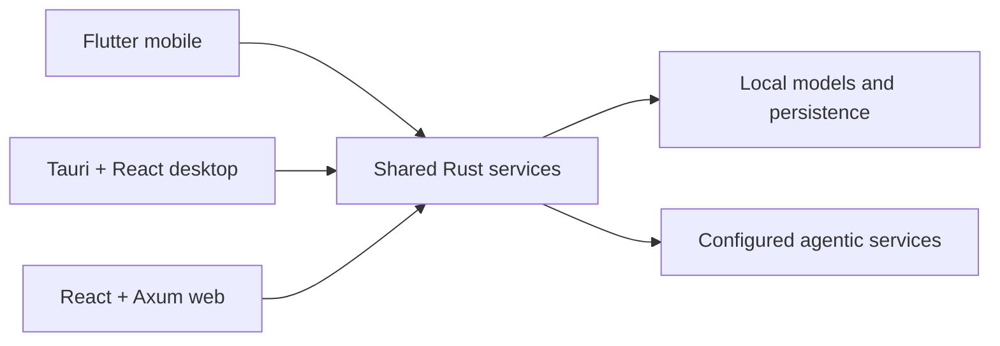

# One core, native surfaces

TJ-ARCH-MOB-001 puts networking, LLM interaction, inference, MCP, agent behavior,
and persistence in a shared Rust workspace. Flutter calls it through generated FFI
on iOS and Android; Tauri exposes thin commands to React 19 on desktop; Axum exposes
the same typed application services for web deployments.

Mobile consumer and healthcare applications use Flutter. Desktop applications use
Tauri and React. The web application reuses the tracked React production bundle;
it is not a fourth independently implemented UI.

## Binding boundaries

- UI components call hooks/providers, never transports directly.
- React uses Prometheus Entity Management 3.x with Zustand; TanStack Query is not
  part of this architecture.
- Browser conversations use PGlite where appropriate; desktop persistence remains
  in Rust, including the pglite-oxide option.
- ContentBlock is the renderer contract for text, thinking, citations, tools,
  artifacts, Markdown, Mermaid, SVG, images, audio, and video.
- A feature is not “working” until a clean checkout builds and a real public-boundary
  workflow passes.
