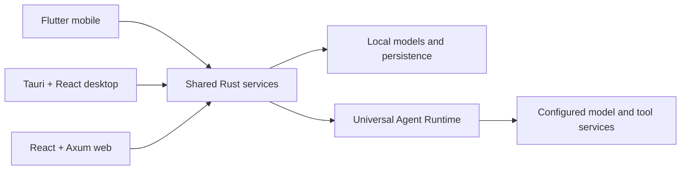

# One core, native surfaces

TJ-ARCH-MOB-001 puts application services, persistence, model adapters, and
typed runtime facades in a shared Rust workspace. Universal Agent Runtime is the
sole authority for agent execution, provider routing, prompts, governed tools,
and run lifecycle. Flutter calls the shared services through generated FFI on
iOS and Android; Tauri exposes thin commands to React on desktop; Axum exposes
the same typed application services for web deployments.

```mermaid
flowchart LR
  Flutter[Flutter mobile] --> Rust[Shared Rust services]
  Tauri[Tauri + React desktop] --> Rust
  Web[React + Axum web] --> Rust
  Rust --> Local[Local models and persistence]
  Rust --> UAR[Universal Agent Runtime]
  UAR --> Cloud[Configured model and tool services]
```

Mobile consumer and healthcare applications use Flutter. Desktop applications use
Tauri and React. The web application reuses the tracked React production bundle;
it is not a fourth independently implemented UI.

## The workspace

The Rust side is a **layered 14-crate workspace**, not a single crate. Trait
boundaries live in `gen_ui_types`; heavy dependencies (SurrealDB, inference
engines) sit in leaf crates that cache independently.

| Layer | Crates |
|---|---|
| L0 | `gen_ui_types` — frozen trait seams, ContentBlock contract, lifecycle |
| L1 | `gen_ui_runtime` · `gen_ui_protocol` |
| L2 | `gen_ui_client` · `gen_ui_mcp` · `gen_ui_db` · `gen_ui_db_graph` · `gen_ui_inference` · `gen_ui_context` |
| L3 | `gen_ui_agent` |
| Leaves | `gen_ui_ffi` · `tauri-plugin-gen-ui` · `gen_ui_wasm` |

**There is no `gen_ui_core` crate.** "gen_ui_core" names an *invariant* — all
networking, LLM interaction, inference, and persistence live in Rust — realised
as the crate family above. Treat any reference to a single `gen_ui_core` crate as
shorthand for that family, not a path.

## Binding boundaries

- UI components call hooks/providers, never transports directly.
- React uses Prometheus Entity Management 3.x with Zustand; TanStack Query is not
  part of this architecture.
- Browser conversations use PGlite where appropriate; desktop persistence remains
  in Rust, including the pglite-oxide option.
- ContentBlock is the renderer contract for text, thinking, citations, tools,
  artifacts, Markdown, Mermaid, SVG, images, audio, and video.
- A feature is not “working” until a clean checkout builds and a real public-boundary
  workflow passes. When a platform baseline or a local-inference lane changes, that
  includes a run on a **physical device** — see [Runtime verification](#runtime-verification).
- Local inference is a **per-device** choice, never one “mobile” engine. See
  [Inference lanes](./inference-lanes).
- Every version pin lives in `versions.toml` and reaches generated code through
  `scripts/portable/versions.mjs`. A version literal inlined in a scaffolder is invisible
  to the drift audit.

## Continue reading

- [Why the Builder is designed this way](./design-principles)
- [Choose a generation profile](./profiles)
- [Install the CLI and harness payloads](../reference/installation)
- [Build or adopt a first project](../reference/first-project)
- [Understand every service boundary](../reference/services)
- [Select and invoke the 29 skills](../reference/skills)

## Runtime verification

Compiling is not evidence. Two failure classes are invisible to every host check:

- **Local-inference lanes fail at model load**, after everything else has passed.
  On iOS an over-budget load is a jetsam process kill — no exception, no log.
- **Native bridges bind by symbol name.** A renamed JNI class path or an
  `@_silgen_name` mismatch compiles clean on both sides and fails at runtime.

A generated project therefore starts **UNVERIFIED**, and that is an accurate
statement until someone runs it on hardware and records the result in
`docs/platform-support.md`.
