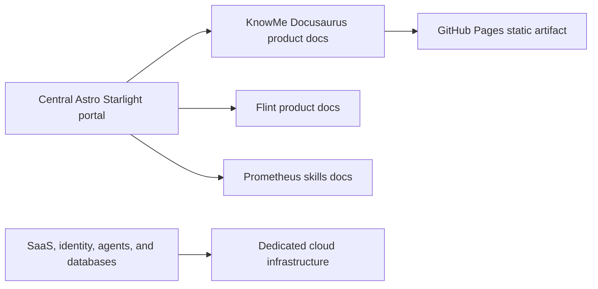

# Prometheus documentation publishing strategy

GitHub Pages is the public static-documentation boundary for this product. It hosts
architecture guidance, reference-application documentation, deployment instructions,
prompting playbooks, release notes, and generated static API references. It does not host
authenticated applications, databases, agents, synchronization services, or commercial
SaaS backends.

## Current product site

KnowMe uses Docusaurus because this documentation is extensive, separated into multiple
content domains, and expected to need versioned product documentation. The source remains
beside the code in `site/`; every merge affecting public documentation performs a frozen
install, sanitization, broken-link enforcement, production build, artifact upload, and
GitHub Pages deployment.

The public site is:

[KnowMe Builder documentation](https://know-me-tools.github.io/hybrid-mobile-architecture-skill/)

The publication boundary rejects raw Prometheus wikis, private Karpathy records, secrets,
personal information, and machine-local paths. GitHub Pages serves only the generated
static artifact.

## Ecosystem topology

A future central Prometheus developer portal should use a dedicated repository and Astro
Starlight at `developers.<domain>`. That portal will provide shared product discovery,
navigation, branding, and federated search while linking to product-owned documentation
such as this site. Product documentation stays with its authoritative source repository;
the central portal indexes reviewed public content instead of copying private histories.

## Custom domains

Until an approved domain is supplied, the repository project URL is canonical and HTTPS
is enforced. Connecting a custom domain requires ownership verification, DNS records, the
GitHub Pages custom-domain setting, and coordinated `SITE_URL`/`BASE_URL` values. Do not
commit a speculative `CNAME` or disable HTTPS to make DNS troubleshooting appear complete.

## API documentation

Generated API references must be deterministic static build inputs. Rustdoc, TypeDoc, and
OpenAPI generation should run before Docusaurus, place reviewed output under an isolated
generated-content path, and pass the same sanitization and link gates. Generated HTML is
never edited directly; changes belong in Rust/TypeScript source, OpenAPI contracts, or the
generation pipeline.
